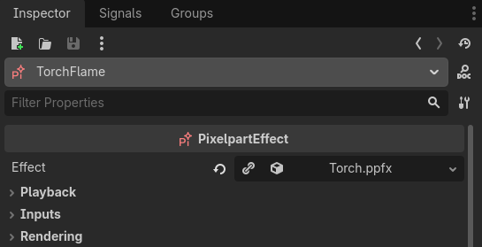
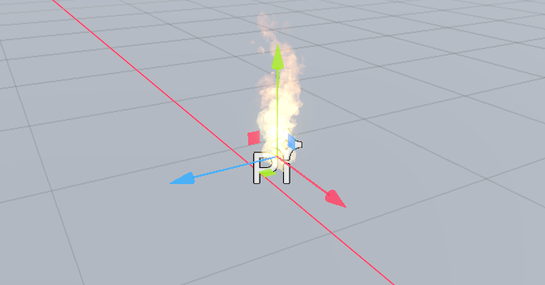

# Pixelpart for Godot 4

This repository contains the official Pixelpart plugin for Godot 4.3+. The plugin allows you to play Pixelpart effects directly within the Godot engine.

## Installation

You can install the plugin from the Godot Asset Library or by downloading it from the Pixelpart website and installing it manually. The plugin comes with prebuilt binaries for the supported platforms (see below).

### Asset Library

The plugin is available in the official Godot Asset Library. Download and install the *Pixelpart* plugin in the Asset Library tab in the Godot editor, then activate it in the project settings.

### Manual Install

You can also manually install the plugin by downloading it from [pixelpart.net](https://pixelpart.net/plugins/). Extract the archive and move the *pixelpart* folder into the *addons* folder below the root folder of your Godot project. You might need to create the *addons* folder if it does not exist yet. Lastly, start the Godot editor and activate the plugin in the project settings.

## Usage

Here are the basic steps to display a Pixelpart effect in Godot. A detailed user guide can be found on [pixelpart.net](https://pixelpart.net/documentation/godot4/).

1. Put the *.ppfx* file created with Pixelpart somewhere in your Godot project. Godot recognizes the *.ppfx* file as a Pixelpart effect if the plugin is installed.

2. Add a *PixelpartEffect* node to the scene (*PixelpartEffect2D* for 2D scenes).

3. Assign the effect resource (the *.ppfx* file) to the *Effect* property of the node. The node should start playing the effect now.

## Supported Platforms

The plugin can be used on the following platforms:

- Windows
- Linux
- macOS
- iOS
- Android
- Web
