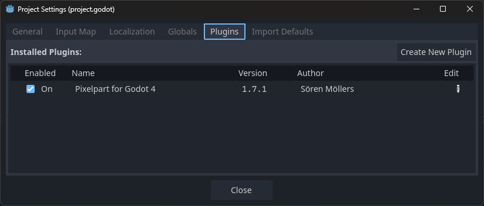

# Installation

The recommended way to install the plugin is from the Godot Asset Library, but it can also be installed manually.

## Asset Library

1. Start the Godot editor and open the *AssetLib* tab.
2. Search for "Pixelpart" and click on the result.
3. Download and then install the plugin.
4. Finally, enable the plugin in the project settings.

## Manual Install

1. Download the plugin from the Pixelpart website and extract the archive.
2. In the root folder of your Godot project, create an *addons* folder if it does not exist yet and move the extracted *pixelpart* folder into the *addons* folder.
3. Start the Godot editor and enable the plugin in the project settings.
4. It may be necessary to restart the Godot editor after enabling the plugin.

## Requirements

Godot 4.3 or higher is required to use the Pixelpart plugin.

## Platform Support

The plugin supports the following platforms:

Platform | Architectures | Supported
-------- | ------------- | ---------
Windows | x64, x86_32 | Yes
Linux | x64, x86_32 | Yes
macOS | Universal | Yes
iOS | arm64 | Yes
Android | arm64, arm32, x64, x86_32 | Yes
Web | wasm32 | Yes
Console | | No
