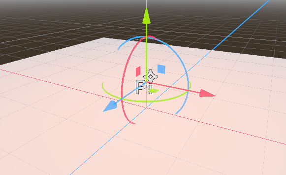
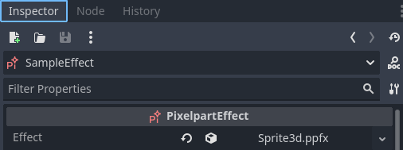

# Usage

## Importing effects

Save the effect you created in Pixelpart as a *.ppfx* file and place it inside the folder of your Godot project. If you have installed the plugin correctly, Godot recognizes the *.ppfx* file as a *Pixelpart Effect*.

## Playing effects

In order to actually play the effect in your game, add a new *PixelpartEffect* node to the scene (*PixelpartEffect2D* for 2D scenes). The effect is shown as a small Pixelpart icon in the scene view and can be moved and rotated like any other node.

Now drag the imported effect asset (*.ppfx* file) onto the *Effect* field in the node's inspector window. The effect should now be visible in the game. If the effect *does not* appear, make sure you have set an appropriate *Effect Scale* value in the node's inspector.

## Effect properties

When you select a *PixelpartEffect* or *PixelpartEffect2D* node, the inspector shows important properties that can be used to adjust how the effect is simulated and rendered.

Property | Description
-------- | -----------
**Effect** | The effect to be played.
**Playing** | Whether the effect is playing or paused.
**Loop** | If enabled, the effect is repeated after the time specified in **Loop Time**.
**Loop Time** | Time in seconds after which the effect is repeated. Only has an effect if **Loop** is enabled.
**Warmup Time** | Time in seconds the effect is pre-simulated before being rendered. This value impacts performance and should be kept as low as possible.
**Speed** | Multiplier for the playback speed of the effect. For example, setting **Speed** to *0.5* shows the effect in slow motion.
**Frame Rate** | How many iterations are simulated per second. Can be used to improve performance for complex effects.
**Seed** | Seed used to initialize the effect simulation. This seed is used if **Random Seed** is not enabled.
**Random Seed** | Whether to use a random seed to initialize the effect simulation.
**Inputs** | Dictionary of effect input values.
**Effect Scale** | Multiplier for the size of the effect. Adjust this value if the effect appears too small or too large in the scene.
**Flip H** | Whether the effect is flipped horizontally. *Only available for PixelpartEffect2D*
**Flip V** | Whether the effect is flipped vertically. *Only available for PixelpartEffect2D*
