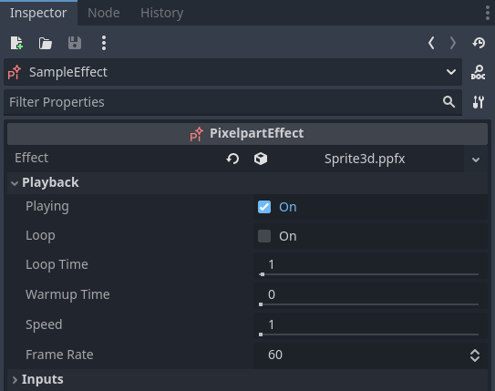

# Usage

## Importing effects

Save the effect you created in *Pixelpart* as a *.ppfx* file and place it inside the folder of your Godot project. If you have installed the plugin correctly, Godot automatically imports the *.ppfx* file as a *Pixelpart Effect*.

## Playing effects

In order to actually play the effect, create a new *PixelpartEffect* node in your scene (*PixelpartEffect2D* for 2D scenes) and move the imported effect asset onto the *Effect* field in the node's inspector window. The effect will now be played inside your game. If the effect *does not* appear, make sure you have set an appropriate *Effect Scale* value in the node's inspector.

You can adjust these properties in the inspector:

Property | Description
-------- | -----------
**Effect** | The effect to be played.
**Playing** | Whether the effect is playing or paused.
**Loop** | If enabled, the effect is repeated after the time specified in **Loop Time**.
**Loop Time** | Time in seconds after which the effect is repeated. Only has an effect if **Loop** is enabled.
**Warmup Time** | Time in seconds the effect is pre-simulated before being rendered. This value impacts performance and should be kept as low as possible.
**Speed** | Multiplier for the playback speed of the effect. For example, setting **Speed** to *0.5* shows the effect in slow motion.
**Frame Rate** | How many iterations are simulated per second. Can be used to improve performance for complex effects.
**Inputs** | Dictionary of effect input values.
**Effect Scale** | Multiplier for the size of the effect. Adjust this value if the effect appears too small or too large in the scene.
**Flip H** | Whether the effect is flipped horizontally. *Only available for PixelpartEffect2D*
**Flip V** | Whether the effect is flipped vertically. *Only available for PixelpartEffect2D*
